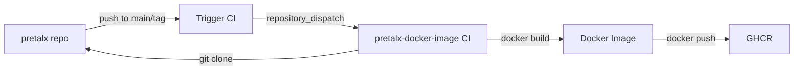

# pretalx Docker Project Structure

This document explains how the pretalx Docker deployment is organized across two repositories.

## Repository Structure

### 1. [pretalx/pretalx](https://github.com/pretalx/pretalx)
**Main Application Repository**

Contains:
- ✅ Django application source code
- ✅ Frontend code (Vue.js schedule editor)
- ✅ Tests and development tools
- ✅ CI/CD for code quality and testing
- ✅ CI trigger for Docker image builds

**Does NOT contain:**
- ❌ Dockerfile
- ❌ docker-compose.yml
- ❌ Docker deployment configuration

### 2. [pretalx/pretalx-docker-image](https://github.com/pretalx/pretalx-docker-image) (This Repository)
**Docker Image Build and Deployment**

Contains:
- ✅ Dockerfile (clones pretalx repository during build)
- ✅ docker-compose.yml (complete deployment stack)
- ✅ Deployment configuration (entrypoint, config templates)
- ✅ Reverse proxy examples (nginx, Traefik)
- ✅ CI/CD for building and publishing Docker images
- ✅ Deployment documentation

## How It Works

### Build Process



1. **Developer pushes to pretalx/pretalx**
   - Triggers `.github/workflows/trigger-docker-build.yml`
   - Sends `repository_dispatch` event to pretalx-docker-image

2. **pretalx-docker-image receives event**
   - Runs `.github/workflows/docker.yml`
   - Clones pretalx repository at specified version
   - Builds Docker image with:
     - Python dependencies
     - Node.js frontend build
     - Static files collection
     - Translations compilation
   - Publishes to GitHub Container Registry

3. **Users deploy**
   - Pull image from GHCR
   - Use docker-compose.yml from this repository
   - Configure via environment variables

### Deployment Flow

```
User
 └─> Clone pretalx-docker-image
     └─> Edit .env
         └─> docker compose up
             ├─> Pulls ghcr.io/pretalx/pretalx:latest
             ├─> Starts PostgreSQL
             ├─> Starts Redis
             ├─> Runs migrations
             ├─> Starts web (Gunicorn)
             └─> Starts worker (Celery)
```

## Benefits of This Structure

### Separation of Concerns
- **pretalx**: Focus on application development
- **pretalx-docker-image**: Focus on deployment and operations

### Independent Versioning
- Application code versions (`v2024.1.0`)
- Docker configuration versions (can be updated independently)

### Flexibility
- Users can:
  - Build from any pretalx version/branch
  - Use pre-built images
  - Customize deployment without touching application code

### Easier Maintenance
- Docker changes don't clutter application repository
- Deployment documentation is separate and focused
- CI/CD pipelines are clearer and more maintainable

## Configuration Options

### Build Arguments

```bash
# Build from specific version
docker build --build-arg PRETALX_VERSION=v2024.1.0 .

# Build from main branch (default)
docker build .
```

### Environment Variables

Set in `.env` file:
- `PRETALX_VERSION`: Version/branch to build (for local builds)
- `PRETALX_IMAGE`: Use pre-built image instead of building
- All application configuration (database, site URL, etc.)

## Development Workflow

### For Application Developers

Work in `pretalx/pretalx`:
```bash
# Local development (no Docker needed)
python -m venv env
source env/bin/activate
pip install -e .
python src/manage.py runserver
```

Docker images are built automatically on push.

### For DevOps/Deployment

Work in `pretalx/pretalx-docker-image`:
```bash
# Test deployment
cp .env.example .env
docker compose up -d

# Customize reverse proxy
cp reverse-proxy-examples/nginx/pretalx.conf /etc/nginx/sites-available/
```

### For Custom Deployments

Options:
1. Use pre-built images with custom docker-compose.yml
2. Fork this repo and customize
3. Build custom images with specific versions

## File Organization

### pretalx-docker-image/
```
├── Dockerfile                      # Multi-stage build
├── docker-compose.yml             # Complete stack
├── .env.example                   # Configuration template
├── deployment/
│   ├── entrypoint.sh             # Container startup script
│   ├── pretalx.cfg               # Config template
│   └── README.md                 # Deployment guide
├── reverse-proxy-examples/
│   └── nginx/                    # Nginx configurations
├── .github/workflows/
│   └── docker.yml                # Image build CI
└── README.md                      # Main documentation
```

### pretalx/ (relevant files)
```
├── src/                           # Application code
├── .github/workflows/
│   └── trigger-docker-build.yml  # Triggers image build
├── DOCKER.md                      # Points to docker-image repo
└── CLAUDE.md                      # Development guide
```

## CI/CD Requirements

### GitHub Secrets

In `pretalx/pretalx` repository:
- `DOCKER_IMAGE_REPO_TOKEN`: Personal Access Token with `repo` scope
  - Used to trigger builds in pretalx-docker-image

### Permissions

The token needs access to dispatch events to pretalx-docker-image repository.

## Support

- Application issues: [pretalx/pretalx issues](https://github.com/pretalx/pretalx/issues)
- Docker/deployment issues: [pretalx/pretalx-docker-image issues](https://github.com/pretalx/pretalx-docker-image/issues)
- Documentation: [docs.pretalx.org](https://docs.pretalx.org/)
